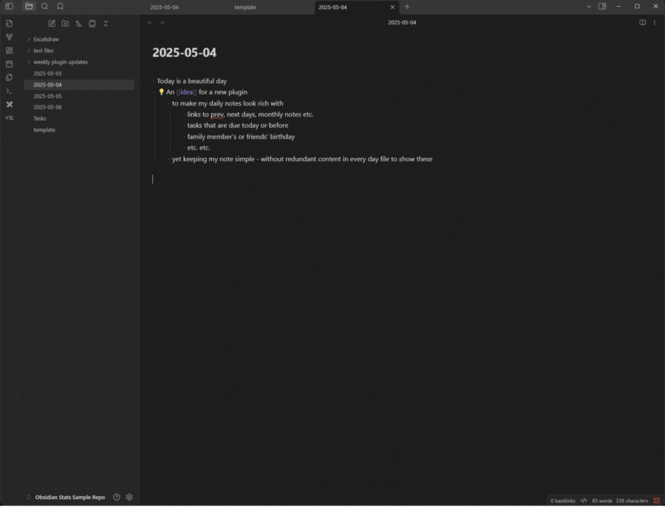

# Dayframe

Dayframe is an [Obsidian](https://obsidian.md/) plugin that adds a customizable "frame" (prefix and suffix content) around your daily notes when viewed in preview mode. This helps keep your raw markdown files clean and focused on the content, while still providing rich, contextual information (like links, queries, or transclusions) in the preview.

Inspired by the desire to simplify my daily notes.



## How it Works

The plugin monitors the active note. If the note is identified as a "daily note" (by its filename matching the `YYYY-MM-DD` format), and you switch to preview mode, Dayframe will:

1.  Read a template you define in its settings.
2.  Split this template using a `{{DAYFRAME}}` placeholder. The content before `{{DAYFRAME}}` becomes the prefix, and the content after becomes the suffix.
3.  Inject and render this prefix and suffix content into the preview of your daily note.
4.  The injected content is automatically removed if you switch to source mode, navigate away from the daily note, or if the note is not a daily note.

This means your actual markdown files for daily notes remain clean, containing only your core content. The "frame" is dynamically added only for viewing.

*  Keeps your `YYYY-MM-DD.md` files free of repetitive template boilerplate.
*  Automatically adds a prefix and/or suffix to your daily notes in preview mode.
*  The prefix and suffix content are rendered as markdown, allowing for links, embeds, and other markdown features.
*  Define your own frame content via the plugin settings using a `{{DAYFRAME}}` placeholder.
*  The frame is updated when you switch between files or change view modes.


## Installation

The plugin is not available in [the official Community Plugins repository](https://obsidian.md/plugins) yet.

### Beta versions

To install the latest beta release of this plugin (regardless if it is available in [the official Community Plugins repository](https://obsidian.md/plugins) or not), follow these steps:

1. Ensure you have the [BRAT plugin](https://obsidian.md/plugins?id=obsidian42-brat) installed and enabled.
2. Click [Install via BRAT](https://intradeus.github.io/http-protocol-redirector?r=obsidian://brat?plugin=https://github.com/ganesshkumar/obsidian-dayframe).
3. An Obsidian pop-up window should appear. In the window, click the `Add plugin` button once and wait a few seconds for the plugin to install.

### Offline (Manual) Installation

1.  Download the latest release files (`main.js`, `manifest.json`, `styles.css` if available) from the [Releases page](https://github.com/ganesshkumar/obsidian-dayframe/releases) of this repository.
2.  In your Obsidian vault, navigate to the `.obsidian/plugins/` directory.
3.  Create a new folder named `dayframe`.
4.  Copy the downloaded files into this new `dayframe` folder.
5.  Reload Obsidian (or disable and re-enable the community plugins).
6.  Enable the "Dayframe" plugin in Obsidian's community plugin settings.

## Configuration

1.  Open Obsidian's settings.
2.  Navigate to "Dayframe" under the "Community plugins" section.
3.  In the "Dayframe Template" setting, enter your desired template.
    *   Use `{{DAYFRAME}}` as a placeholder to indicate where your daily note's actual content should appear.
    *   Content before `{{DAYFRAME}}` will be your prefix.
    *   Content after `{{DAYFRAME}}` will be your suffix.
    *   If `{{DAYFRAME}}` is not present, the entire template will be treated as the prefix.

**Example Template From Demo:**

This template uses (though none of them are mandatory)
- [CSS based Multicolumn](https://github.com/efemkay/obsidian-modular-css-layout?tab=readme-ov-file#multi-column)
- [Dataview](https://blacksmithgu.github.io/obsidian-dataview/)


````markdown
```dataviewjs
let fileDate = window.moment(dv.current().file.name, "YYYY-MM-DD");
let yesterday = moment(fileDate).subtract(1, "day").format("YYYY-MM-DD");
let tomorrow = moment(fileDate).add(1, "day").format("YYYY-MM-DD");
dv.paragraph(`[[${yesterday}|Yesterday]] Today [[${tomorrow}|Tomorrow]]`);
```


```dataviewjs
// Define greeting messages for different times of the day
const greetings = {
  morning: [
    "Good morning! ☀️",
    "Rise and shine! 🌅",
    "Top of the morning to you!",
    "Wakey, wakey!",
    "Morning, sunshine!"
  ],
  afternoon: [
    "Good afternoon! ☀️",
    "Hope your day is going well!",
    "Keep up the great work!",
    "Hello there!",
    "Enjoy your afternoon!"
  ],
  evening: [
    "Good evening! 🌇",
    "Hope you had a great day!",
    "Relax and unwind!",
    "Evening vibes!",
    "Time to relax!"
  ],
  night: [
    "Good night! 🌙",
    "Sweet dreams!",
    "Rest well!",
    "Sleep tight!",
    "Nighty night!"
  ]
};

// Simple hash function to generate a consistent number from a string
function hashString(str) {
  let hash = 0;
  for (let i = 0; i < str.length; i++) {
    hash = ((hash << 5) - hash) + str.charCodeAt(i);
    hash |= 0; // Convert to 32bit integer
  }
  return Math.abs(hash);
}

// Get the current date in YYYY-MM-DD format
const today = moment().format("YYYY-MM-DD");

// Determine the current hour
const hour = moment().hour();

// Determine the time period
let timePeriod;
if (hour >= 5 && hour < 12) {
  timePeriod = "morning";
} else if (hour >= 12 && hour < 17) {
  timePeriod = "afternoon";
} else if (hour >= 17 && hour < 21) {
  timePeriod = "evening";
} else {
  timePeriod = "night";
}

// Select a greeting based on the hashed date
const messages = greetings[timePeriod];
const index = hashString(today) % messages.length;
const greeting = messages[index];

// Display the greeting as an H1 header
dv.header(1, greeting);
```


> [!multi-column]
> > [!danger] Tasks Overdue
> > ```dataviewjs
> > const fileDate = moment(dv.current().file.name, "YYYY-MM-DD");
> > 
> > dv.taskList(
> >   dv.pages()
> >     .file
> >     .tasks
> >     .where(t => !t.completed && t.due && moment(t.due.toString()).isBefore(fileDate)),
> >   { 
> >     heading: "Tasks Overdue", 
> >     groupByFile: false 
> >   }
> > );
> > ```
> 
> > [!todo] Tasks Overdue
> > ```dataviewjs
> > const fileDate = moment(dv.current().file.name, "YYYY-MM-DD");
> > 
> > dv.taskList(
> >   dv.pages()
> >     .file
> >     .tasks
> >     .where(t => !t.completed && t.due && moment(t.due.toString()).isSame(fileDate, 'day')),
> >   { 
> >     heading: "Tasks Overdue", 
> >     groupByFile: false 
> >   }
> > );
> > ```
>
> > [!tip] Upcoming tasks
> > ```dataviewjs
> > const fileDate = moment(dv.current().file.name, "YYYY-MM-DD");
> > 
> > dv.taskList(
> >   dv.pages()
> >     .file
> >     .tasks
> >     .where(t => !t.completed && t.due && moment(t.due.toString()).isAfter(fileDate)),
> >   { 
> >     heading: "Tasks Overdue", 
> >     groupByFile: false 
> >   }
> > );
> > ```

---

{{DAYFRAME}}

---

## Remember to 

- **Celebrate Today's Wins**: Acknowledge three accomplishments, big or small, that made today meaningful.
- **Reflect on Lessons Learned**: Consider any challenges faced and the insights gained from them.
- **Express Gratitude**: Note down people, experiences, or moments you're thankful for today.
- **Plan for Tomorrow**: Identify one or two key tasks or goals to focus on in the next day.
- **Unwind and Relax**: Engage in an activity that helps you decompress and prepare for restful sleep

````

## Debugging

By default, debug messages for this plugin are hidden.

To show them, run the following command in the `DevTools Console`:

```js
window.DEBUG.enable('dayframe');
```

For more details, refer to the [documentation](https://github.com/mnaoumov/obsidian-dev-utils/blob/main/docs/debugging.md).

## License

[MIT License](./LICENSE)
